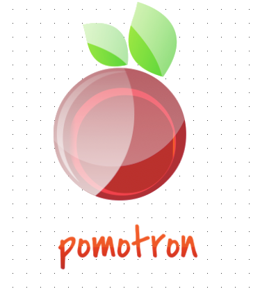

# Projeto Pomotron

### Tecnologias usadas para desenvolvimento

 - [x] HTML5
 - [x] CSS3
 - [x] TypeScript
 - [x] Angular JS 1.5
 - [x] Electron JS
 - [x] Node JS
 

O projeto pomotron visa a construção de uma aplicação cujo objetivo é tirar métricas do tempo para estudo ou outras tarefas em geral.

O projeto utiliza a técnica do pomodoro para que o usuário consiga definir um tempo para que sua tarefa ou estudo seja concluída. Ao concluir a tarefa o pomotron irá persistir os dados em um arquivo **.json** os dados de tempo de todas as tarefas ou estudo concluídos.

Esses dados armazenados em um arquivo **.json**, será utilizado para gerar métricas de tempo por tarefa ou ao longo do mês ou ano.
